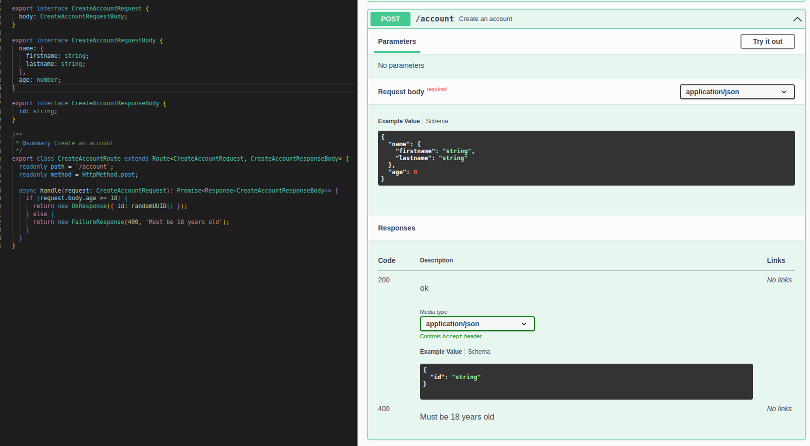
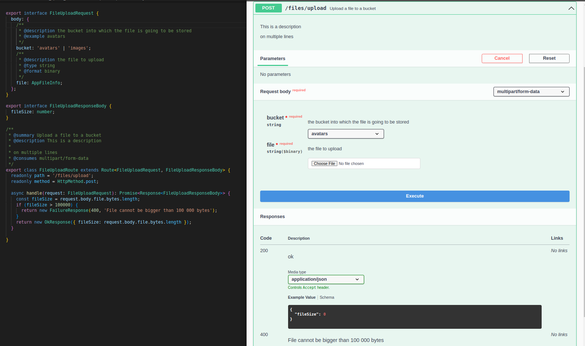

# open_router ( Prototype - naive take )

Server agnostic route handler to open api compiler.





# How does this work ?

The compiler analyze your code to generate an open api path object:

  - It looks at the comments tags to find @summary, @description, @cosumes, @produces
  - It looks into your request interface to understand the shape of the body and query
  - It looks into your handler method to see if it spots any failure being returned 
  - ...

Example:

```ts
export interface CreateAccountRequest {
  body: CreateAccountRequestBody;
}

export interface CreateAccountRequestBody {
  name: {
    firstname: string;
    lastname: string;
  },
  age: number;
}

export interface CreateAccountResponseBody {
  id: string;
}

/**
 * @summary Create an account
 */
export class CreateAccountRoute extends Route<CreateAccountRequest, CreateAccountResponseBody> {
  readonly path = `/account`;
  readonly method = HttpMethod.post;

  async handle(request: CreateAccountRequest): Promise<Response<CreateAccountResponseBody>> {
    if (request.body.age >= 18) {
      return new OkResponse({ id: randomUUID() });
    } else {
      return new FailureResponse(400, 'Must be 18 years old');
    }
  }
}
```

The compiler will generate the following path object:

```yaml
  "/account":
    post:
      summary: Create an account
      description: ''
      requestBody:
        required: true
        content:
          application/json:
            schema:
              type: object
              properties:
                name:
                  type: object
                  properties:
                    firstname:
                      type: string
                    lastname:
                      type: string
                  required:
                  - firstname
                  - lastname
                  additionalProperties: false
                age:
                  type: number
              required:
              - name
              - age
              additionalProperties: false
      responses:
        '200':
          description: ok
          content:
            application/json:
              schema:
                type: object
                properties:
                  id:
                    type: string
                required:
                - id
                additionalProperties: false
        '400':
          description: Must be 18 years old
```

# Usage compilation 

The compiler will look for routes in your code and transform those into an openapi document

```ts
const myOpenApiDoc = compileOpenApiDocument([
  // we pass the file from which the compiler will start to look,
  // usually a file importing the routes.
  'src/server.ts',
]);

```

This can then be server in a swagger ui or used as request validation with an open api validator.